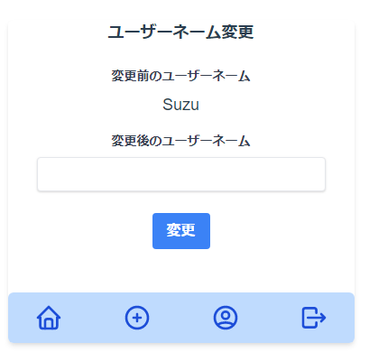

Black (チャットアプリ) - フロント側
==

Rails と Vue で開発したチャットアプリ

主な機能
- ユーザー認証
- ユーザー名変更
- チャットルーム作成
- 入室・退室
- チャット

[API側のGitHubリポジトリURL](https://github.com/utouto97/black_api)  
https://github.com/utouto97/black_api

## テクノロジースタック

- node.js
- Vue.js (+ Composition API)
- Tailwind CSS
- Firebase Auth
- Axios (API叩く用)

詳細は、package.jsonを参照

## UI

- 新規登録

- ログイン

- ルーム作成

- ルーム一覧

- 入室

- ユーザー名変更

- チャットルーム

- ナビゲーション

